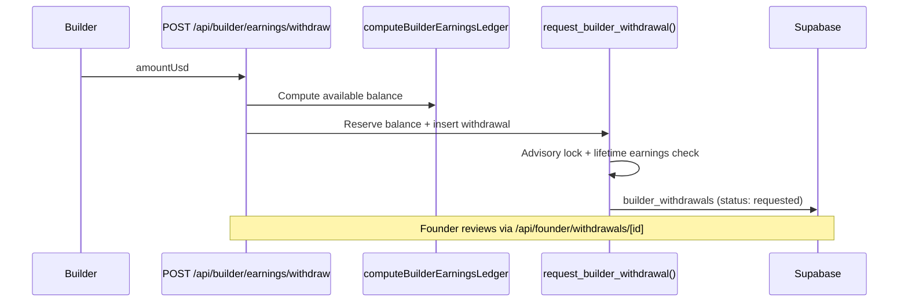

# Builder Earnings Audit — Phase 1

Audit date: 2026-07-19

---

## Earnings calculation locations

### TypeScript

| File | Function / export | Purpose | Formula |
|------|-------------------|---------|---------|
| `lib/builder/earningsLedger.ts` | `computeBuilderEarningsLedger()` | **Primary ledger engine** | See breakdown below |
| `lib/builder/earningsLedger.ts` | `BUILDER_PLATFORM_FEE_USD = 5` | Flat fee on escrow gross | `net = gross - 5` |
| `lib/builder/earningsLedger.ts` | `collabNetFromGross()` | Uninvoiced collab earnings | `max(0, gross - 5)` |
| `lib/builder/earningsLedger.ts` | `componentNetFromTransaction()` | Component/solution sales | `max(0, amount_usd - fee_usd)` |
| `lib/builder/earningsLedger.ts` | `MIN_WITHDRAWAL_USD = 10` | Withdrawal floor | — |
| `lib/builder/earningsLedger.ts` | `RESERVED_WITHDRAWAL_STATUSES` | Balance reservation | Sums requested→completed withdrawals |
| `lib/hire/calculateBudget.ts` | `platformFee()`, `builderReceives()` | Custom project UI preview | **5% fee** (inconsistent with $5 flat) |
| `lib/milestones/platformFees.ts` | `builderNetAfterOpenProposalFee()` | Open project proposal net display | `proposed - $5` |
| `lib/solutions/constants.ts` | `platformFeeForInstantPurchase()` | Instant purchase fee helper | `<$20 → $1, else $5` (not used in earnings ledger) |
| `app/builder/wallet/page.tsx` | inline | Wallet page balance | Sums `invoices.net_payout_usd` where status `paid`/`processing`; fallback `profiles.total_earnings_usd` |

### API routes (consumers)

| File | Line | Usage |
|------|------|-------|
| `app/api/builder/earnings/route.ts` | 20 | GET ledger via `computeBuilderEarningsLedger()` |
| `app/api/builder/earnings/withdraw/route.ts` | 75, 185 | Balance check + post-withdrawal refresh |
| `app/api/builder/dashboard/route.ts` | 24 | Dashboard stats include ledger summary |

### SQL RPC / functions

| File | Function | Purpose | Formula |
|------|----------|---------|---------|
| `supabase/migrations/20260704152000_withdrawal_workflow_hardening.sql` | `compute_builder_lifetime_earnings_usd(p_builder_id)` | Mirror TS lifetime earnings for withdrawal RPC | invoice net + (collab escrow - 5) + component net |
| Same migration | `request_builder_withdrawal(...)` | TOCTOU-safe withdrawal insert | Uses lifetime fn minus reserved withdrawals |
| `supabase/migrations/20260701193000_builder_earnings_ledger.sql` | Initial ledger schema | `builder_withdrawals`, indexes | — |

### Frontend (display only)

| File | Purpose |
|------|---------|
| `components/builder/EarningsLedgerPanel.tsx` | Ledger UI + withdraw form |
| `lib/builder/useEarningsLedger.ts` | Realtime hook; subscribes to invoices, escrow_transactions, withdrawals |
| `app/builder/wallet/page.tsx` | Simplified balance view |
| `components/open-projects/ProposalWizard.tsx` | Net payout estimate for builders |

### Arena / profile (non-wallet)

| File | Purpose |
|------|---------|
| `lib/arena/calculator.ts` | Builder arena score signals |
| `lib/arena/badges/evaluators.ts` | Completion rate from collab signals |

---

## `computeBuilderEarningsLedger()` breakdown

**Inputs queried:**
- `collabs` (builder's projects)
- `milestones` (amounts, statuses)
- `invoices` (released milestone payouts)
- `transactions` (component_purchase, completed)
- `escrow_transactions` (milestone_funding)
- `builder_withdrawals`
- `builder_payout_methods`
- `components` (for sale titles)

**lifetimeEarnedUsd sources:**
1. **Invoices** — sum `net_payout_usd` where status is `paid` or `processing`
2. **Uninvoiced completed collabs** — collabs with status `completed`/`released` and no invoice: `escrow_amount_usd - 5`
3. **Component sales** — completed `component_purchase` transactions: `amount_usd - fee_usd`

**pendingEscrowUsd sources (priority order):**
1. `escrow_transactions` with `milestone_funding` + locked milestone statuses
2. Fallback: milestones in `funded`/`in_progress`/`submitted`
3. Fallback: collabs in active statuses × `escrow_amount_usd`

**availableBalanceUsd:** `lifetimeEarnedUsd - totalWithdrawnUsd` (withdrawals in reserved statuses)

**Ledger transaction types emitted:**
- `milestone_release` — from invoices or uninvoiced collabs
- `component_sale` — from component transactions
- `escrow_deposit` — from escrow_transactions
- `escrow_refund` — synthetic negative entry for cancelled collabs with funded escrow
- `withdrawal` — from builder_withdrawals

---

## SQL mirror (`compute_builder_lifetime_earnings_usd`)

```sql
-- Invoice earnings: SUM(net_payout_usd) WHERE status IN ('paid', 'processing')
-- Collab earnings: SUM(escrow_amount_usd - 5) WHERE status IN ('completed','released') AND no invoice
-- Component earnings: SUM(amount_usd - fee_usd) FROM completed component_purchase txns
```

**Hardcoded `5`** in SQL matches `BUILDER_PLATFORM_FEE_USD` in TypeScript.

---

## Withdrawal flow



**Founder withdrawal state machine:** `app/api/founder/withdrawals/[id]/route.ts`  
Statuses: `requested → pending_review → approved → processing → completed | failed | cancelled`

---

## Inconsistencies (Phase 2 targets)

| Issue | Location A | Location B |
|-------|------------|------------|
| Flat $5 vs 5% fee | `earningsLedger.ts` | `calculateBudget.ts` |
| Service purchase earnings | Not in ledger (only `component_purchase`) | `fulfillRazorpayPayment` uses `service_purchase` type |
| SQL vs TS drift risk | `compute_builder_lifetime_earnings_usd` | `computeBuilderEarningsLedger` |
| Wallet page vs ledger | Direct invoice sum | Full ledger computation |

---

## Files to integrate in Finance Phase 2

1. `lib/builder/earningsLedger.ts` — central earnings engine
2. `supabase/migrations/20260704152000_withdrawal_workflow_hardening.sql` — SQL RPC
3. `app/api/builder/earnings/withdraw/route.ts` — withdrawal request
4. `app/api/founder/withdrawals/[id]/route.ts` — payout execution (manual today)
