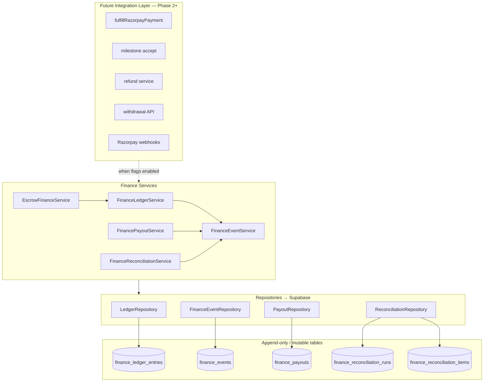
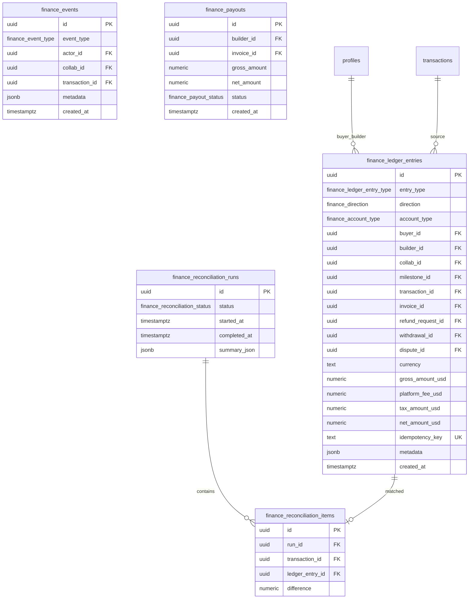

# Finance V2 Foundation

**Phase 1 — Infrastructure only**  
Created: 2026-07-19

This document describes the Finance V2 foundation layer. It is **not wired** to existing checkout, milestones, invoices, refunds, withdrawals, or Razorpay flows. All feature flags remain `false`.

---

## Architecture



---

## Folder Structure

```
lib/finance/
├── index.ts                 # Root barrel
├── constants/               # Fees, currency, flags, table names
├── enums/                   # Typed domain enums (mirror DB enums)
├── types/                   # Row interfaces + dashboard DTOs
│   └── dto/                 # Future founder dashboard response models
├── validators/              # Money, currency, ledger, transitions, idempotency
├── utils/                   # Formatting, UUID, dates, idempotency keys
├── repositories/            # Supabase CRUD (DI-friendly)
├── services/                # Business orchestration (inactive until flags)
├── ledger/                  # Domain re-exports
├── events/
├── payouts/
└── reconciliation/

supabase/migrations/
└── 20260718230000_finance_foundation.sql

docs/finance/
└── finance-foundation.md    # This file
```

---

## Database ER



### Append-only enforcement

- `finance_ledger_entries` and `finance_events` have `BEFORE UPDATE/DELETE` triggers calling `finance_deny_mutation()`.
- RLS: `is_platform_admin()` SELECT only; inserts via service role (bypasses RLS).
- No client-facing INSERT/UPDATE/DELETE policies on append-only tables.

---

## Responsibilities

| Layer | Role | Business logic? |
|-------|------|-----------------|
| **Repositories** | Supabase CRUD, filter queries | No |
| **Validators** | Field validation, state transitions, idempotency | No |
| **Services** | Orchestrate repos + validators + events | Yes |
| **Constants/Enums** | Single source of typed values | No |
| **Types/DTOs** | Contracts for DB rows and future dashboards | No |

### Service methods (inactive until flags)

| Service | Method | Future caller |
|---------|--------|---------------|
| FinanceLedgerService | `recordLedgerEntry()` | Payment fulfillment, refunds |
| FinanceEventService | `recordFinanceEvent()` | All finance lifecycle hooks |
| EscrowFinanceService | `fundEscrow()` | fulfillRazorpayPayment |
| EscrowFinanceService | `freezeEscrow()` | Dispute open |
| EscrowFinanceService | `releaseEscrow()` | Milestone accept |
| EscrowFinanceService | `recordRefund()` | Refund execution |
| FinancePayoutService | `createPayout()` | Milestone accept / invoice |
| FinancePayoutService | `completePayout()` | Withdrawal / Route transfer |
| FinanceReconciliationService | `startReconciliation()` | Nightly cron |
| FinanceReconciliationService | `completeReconciliation()` | Nightly cron |

---

## Feature Flags

Defined in `lib/finance/constants/featureFlags.ts` — **all remain `false`**:

| Flag | Gates |
|------|-------|
| `FINANCE_V2` | EscrowFinanceService |
| `LEDGER_ENABLED` | FinanceLedgerService |
| `FINANCE_EVENTS_ENABLED` | FinanceEventService |
| `PAYOUT_ENGINE_ENABLED` | FinancePayoutService |
| `RECONCILIATION_ENABLED` | FinanceReconciliationService |
| `FINANCE_DASHBOARD_ENABLED` | Future UI (not built) |

---

## Future Integration Plan

### Phase 2 — Dual-write (optional)

1. Enable `LEDGER_ENABLED` + `FINANCE_EVENTS_ENABLED`.
2. Add calls in `fulfillRazorpayPayment` after successful capture.
3. Add calls in milestone accept for release entries.
4. Parity tests: compare `lib/builder/earningsLedger.ts` aggregates vs SQL on `finance_ledger_entries`.

### Phase 3 — Payout engine

1. Enable `PAYOUT_ENGINE_ENABLED`.
2. Wire milestone accept → `createPayout()`.
3. Wire withdrawal API → `completePayout()` with Razorpay Route.

### Phase 4 — Reconciliation

1. Enable `RECONCILIATION_ENABLED`.
2. Nightly job: compare `transactions` vs ledger, write items.
3. Surface discrepancies in founder dashboard.

### Phase 5 — Dashboard

DTOs exist in `lib/finance/types/dto/dashboard.ts`:

- `FinanceOverviewResponse`
- `LedgerExplorerResponse`
- `FinanceInboxResponse`
- `PayoutQueueResponse` / `RefundQueueResponse` / `DisputeQueueResponse`
- `FinanceHealthResponse`

Enable `FINANCE_DASHBOARD_ENABLED` and build `/founder/finance/*` pages consuming these shapes.

---

## Related Audits

See existing Phase 1 audits in `docs/finance/`:

- `legacy-finance.md` — routes to migrate
- `funding-flow.md`, `escrow-audit.md`, `invoice-audit.md`
- `platform-fee-audit.md`, `builder-earnings-audit.md`, `status-audit.md`

Look for `TODO(FINANCE_PHASE_1)` markers in codebase for exact integration points.
