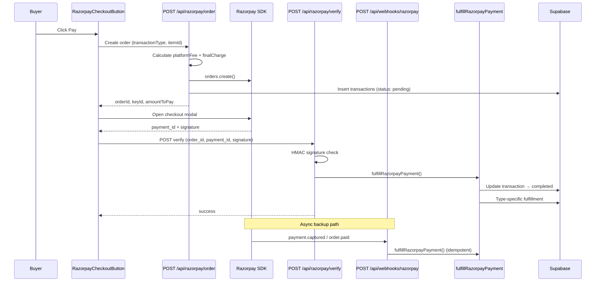
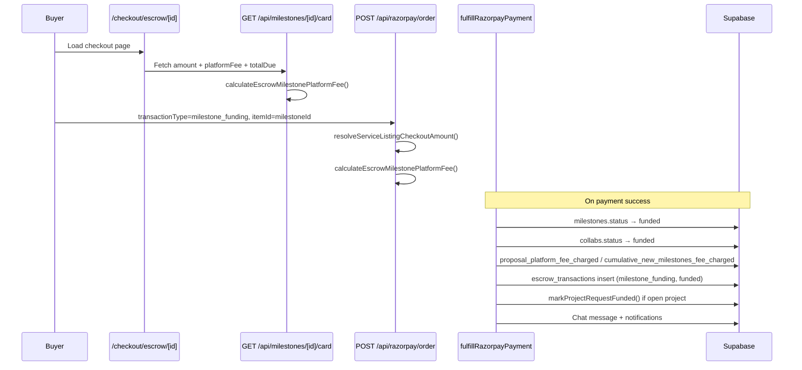
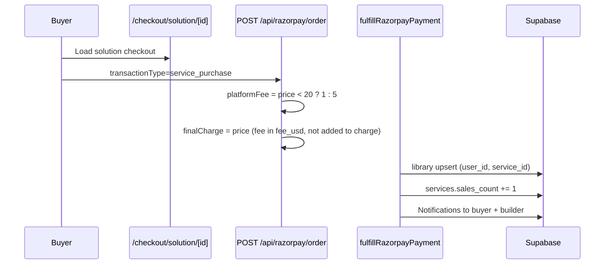
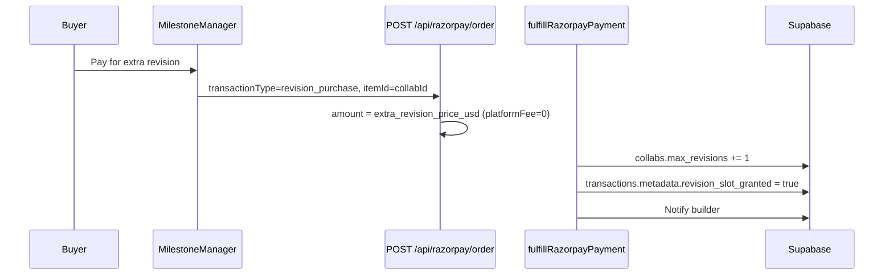
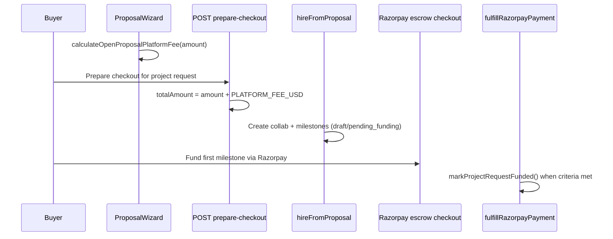
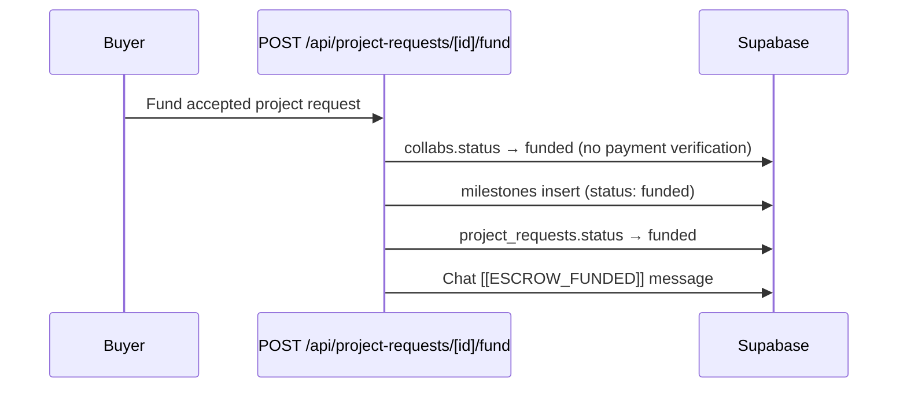

# Funding Flow Audit — Phase 1

Audit date: 2026-07-19  
Payment provider: **Razorpay** (primary) + **legacy direct-fund routes** (no payment gateway)

---

## Funding paths overview

| Path | Entry point | Payment? | Fulfillment |
|------|-------------|----------|-------------|
| Escrow milestone | `/checkout/escrow/[milestoneId]` | Razorpay | `fulfillRazorpayPayment('escrow')` |
| Service purchase (instant) | `/checkout/solution/[serviceId]` | Razorpay | `fulfillRazorpayPayment('solution')` |
| AI asset (legacy component) | `/checkout/asset/[componentId]` | Razorpay | `fulfillRazorpayPayment('asset')` |
| Extra revision | MilestoneManager → RazorpayCheckoutButton | Razorpay | `fulfillRazorpayPayment('revision')` |
| Open project proposal | ProposalWizard → checkout | Razorpay (via milestone) | Same as escrow |
| Legacy project fund | `POST /api/project-requests/[id]/fund` | **None** | Direct DB updates |
| Legacy milestone fund | `POST /api/project-requests/[id]/fund-milestones` | **None** | Direct DB updates |
| Service hire (collab create) | Service page / hire flow | Deferred to Razorpay | Collab `pending_funding` |

---

## Primary Razorpay flow (all checkout types)

**Key files:**
- `components/RazorpayCheckoutButton.tsx` — client orchestration (lines ~412, 502)
- `app/api/razorpay/order/route.ts` — order creation + fee calculation
- `app/api/razorpay/verify/route.ts` — signature verify + fulfill
- `app/api/webhooks/razorpay/route.ts` — webhook backup fulfill
- `lib/payments/fulfillRazorpayPayment.ts` — shared fulfillment

---

## Escrow milestone funding

**Transaction types mapped to escrow:** `escrow_funding`, `collab_milestone`, `milestone_funding`  
**Preflight:** `GET /api/razorpay/preflight`  
**Library sync fallback:** `POST /api/buyer/library/sync` can call fulfill for stuck payments

---

## Service purchase (instant AI Solution)

**Note:** For instant purchases, `finalCharge = amountUsd` (buyer pays listing price); platform fee is recorded separately in `transactions.fee_usd`.

---

## AI asset purchase (legacy component)

Same as service purchase but:
- `transactionType=component_purchase`
- `checkoutType=asset` (mapped internally to `solution` path in order route for components)
- Fulfill writes to `library.component_id` and updates `components.sales_count`

Legacy acquire routes (non-Razorpay): `app/api/assets/[id]/acquire/route.ts`, `app/api/solutions/[id]/acquire/route.ts`

---

## Extra revision purchase

---

## Open project / proposal funding

**Files:** `lib/open-projects/hireFromProposal.ts`, `app/api/project-requests/[id]/prepare-checkout/route.ts`, `lib/project-proposals/service.ts`

---

## Legacy fund routes (no Razorpay)

**Risk:** No transaction record, no Razorpay capture, no `escrow_transactions` insert.  
**Replacement:** Razorpay escrow checkout via `prepare-checkout` + milestone funding.

---

## Order reuse & cleanup

| Mechanism | File | Purpose |
|-----------|------|---------|
| Pending order reuse | `app/api/razorpay/order/route.ts` | Reuse valid pending transaction if amount/fee match |
| Force refresh | Same | Expire stale pending transactions |
| Checkout cleanup cron | `app/api/checkout/cleanup/route.ts` | Expire abandoned `pending_funding` collabs |
| Preflight validation | `app/api/razorpay/preflight/route.ts` | Pre-open checkout validation |
| Error logging | `app/api/razorpay/checkout-error/route.ts` | Client-side failure telemetry |

---

## Currency conversion

`lib/payments/razorpayCurrency.ts` — `convertUsdToRazorpayCheckoutAmount()` converts USD display amounts to Razorpay smallest currency unit for order creation.
