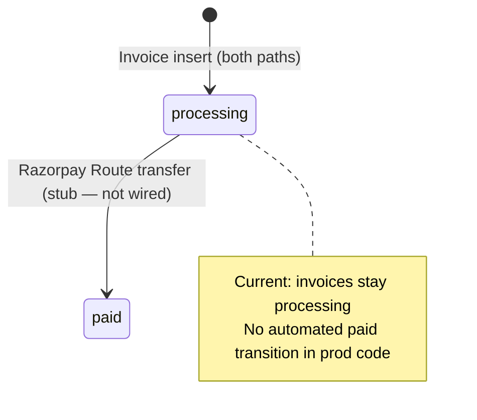

# Invoice Creation Audit — Phase 1

Audit date: 2026-07-19

---

## Invoice creation locations

| File | Line | Trigger | Current fields | Platform fee logic | Builder payout logic |
|------|------|---------|----------------|--------------------|-----------------------|
| `app/api/milestones/[id]/route.ts` | 298–308 | Buyer **accept** milestone action (`action=accept`) | `collab_id`, `buyer_id`, `builder_id`, `gross_amount_usd`, `platform_fee_usd`, `net_payout_usd`, `invoice_number`, `status: 'processing'` | Hardcoded `platform_fee_usd: 5` | `net_payout_usd = max(0, gross - 5)` |
| `app/api/workspace/billing/route.ts` | 94–108 | Buyer POST `action: 'release_escrow'` on collab | Same fields as above | `FLAT_PLATFORM_FEE_USD = 5.00` | `netPayout = grossAmount - FLAT_PLATFORM_FEE_USD` |

**No other `invoices.insert` calls found in application code.**

---

## Milestone accept invoice (primary path)

**Trigger flow:**
1. Buyer clicks Accept on milestone in `MilestoneManager` or chat card
2. `PATCH /api/milestones/[id]` with `action: 'accept'`
3. Milestone status → `released`
4. Deliverable status → `accepted`
5. Invoice inserted with `status: 'processing'`
6. Builder notification sent

**Invoice number format:** `ZEL-INV-${Date.now().slice(-8)}`

**Fields populated:**

```typescript
{
  collab_id: milestone.collab_id,
  buyer_id: collab.buyer_id,
  builder_id: collab.builder_id,
  gross_amount_usd: milestone.amount_usd,
  platform_fee_usd: 5,
  net_payout_usd: Math.max(0, Number(milestone.amount_usd) - 5),
  invoice_number: invoiceNumber,
  status: 'processing',
}
```

**Not set at creation:** `payout_transaction_id`, `paid` transition (no Razorpay Route transfer wired yet)

---

## Workspace billing release invoice (legacy path)

**Trigger flow:**
1. Buyer calls `POST /api/workspace/billing` with `{ collabId, action: 'release_escrow' }`
2. Validates collab status is `pending_approval` or `completed`
3. Validates no active dispute
4. Creates invoice with random 6-digit suffix: `ZEL-INV-${100000–999999}`
5. Sets collab status → `completed`
6. Razorpay Route transfer is **commented out** (stub only)

**Platform fee:** Flat $5.00 from local constant.

**Payout:** Calculated but not executed — transfer code block is commented (lines 114–127).

---

## Invoice consumption (read paths)

| File | Purpose |
|------|---------|
| `lib/builder/earningsLedger.ts` | Lifetime earnings from `net_payout_usd`; cleared when status `paid` or `processing` |
| `lib/billing/fetchBillingHistory.ts` | Buyer billing history display |
| `app/builder/wallet/page.tsx` | Available balance from paid/processing invoices |
| `app/builder/dashboard/page.tsx` | Realtime subscription on invoices table |
| `supabase/migrations/20260704152000_withdrawal_workflow_hardening.sql` | SQL `compute_builder_lifetime_earnings_usd` sums invoice net |
| `supabase/migrations/20260703190000_founder_command_center.sql` | Founder RLS policy for invoice reads |

---

## Invoice status lifecycle (observed)



---

## Gaps for Finance Phase 2

1. **Two creation paths** with different invoice number formats
2. **No idempotency** — double accept could create duplicate invoices (guarded by milestone status transition)
3. **No link** from invoice to source milestone or transaction
4. **Payout engine stub** in workspace billing; milestone path has no payout call at all
5. **Fee hardcoded** at both sites — not read from `transactions.fee_usd` charged at funding time
