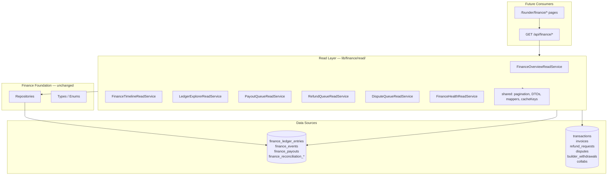

# Finance Read Layer

Read-only aggregation layer for the future Zelance Finance Command Center. Sits above Finance V2 repositories and production shadow tables; performs no writes, no payment side effects, and no UI wiring.

## Architecture



## Design Principles

| Rule | Implementation |
|------|----------------|
| Repositories handle CRUD | Read services call `LedgerRepository`, `FinanceEventRepository`, `PayoutRepository` for list queries |
| Read services handle aggregation | Overview sums, timeline merge, health diagnostics live in read services |
| No raw DB rows in public API | All returns use DTOs in `read/shared/dto/` |
| Every list supports pagination | `page`, `pageSize`, `sort`, `direction`, filters via `parsePaginationParams` |
| No UI aggregation | Pages will call read services (via future API routes), never repositories directly |
| No caching yet | Key patterns documented in `read/shared/cacheKeys.ts` |

## Service Responsibilities

### FinanceOverviewReadService

Aggregates KPI header metrics:

- Escrow balance
- Platform revenue (lifetime)
- Pending payouts / refunds / disputes
- Builder payables
- Today’s and monthly revenue

**Strategy:** If `finance_ledger_entries` has rows, prefer Finance V2 ledger sums; otherwise fall back to production `transactions`, `collabs`, `refund_requests`, `disputes`, `invoices`, and `builder_withdrawals`. Returns `dataSource: finance_v2 | production_shadow | mixed`.

### FinanceTimelineReadService

Merges normalized timeline items from:

- `finance_events`
- `finance_ledger_entries`
- `finance_payouts`
- `refund_requests`
- `disputes`
- `builder_withdrawals`

Filters: entity, builder, buyer, invoice, collab, transaction, date range, event type, status. Sorted newest first (configurable).

### LedgerExplorerReadService

Paginated search of `finance_ledger_entries` with filters for builder, buyer, invoice, collab, transaction, entry type, direction, date range. Uses `LedgerRepository` when filters are simple; direct query for extended filters and exact counts.

### PayoutQueueReadService

Unified payout queue from:

- `finance_payouts` (Finance V2)
- `builder_withdrawals` (production)
- `invoices` in processing (production)

Status filters: pending, processing, completed, failed. Flags `requiresFounderAction` for pending/processing items.

### RefundQueueReadService

Queue from `refund_requests` with status mapping:

| Queue filter | DB statuses |
|--------------|-------------|
| waiting_builder | requested |
| waiting_founder | builder_responded |
| pending | founder_review, approved, processing |
| approved | approved |
| rejected | rejected |
| completed | completed |

Optional batch enrichment from `finance_events` via `enrichWithFinanceEvents()`.

### DisputeQueueReadService

Queue from `disputes` with status mapping:

| Queue filter | DB statuses |
|--------------|-------------|
| waiting_buyer | waiting_for_buyer |
| waiting_builder | waiting_for_freelancer |
| waiting_founder | under_review, arbitration_requested |
| settlement_pending | negotiation |
| closed | resolved, closed |

Batch-fetches collab escrow amounts to populate `amountAtStakeUsd`.

### FinanceHealthReadService

Actionable issue detection:

| Issue type | Source |
|------------|--------|
| missing_payout_profile | builders with invoices but no `builder_payout_methods` |
| escrow_aged | collabs with escrow > N days |
| refund_pending_too_long | active refund_requests older than N days |
| failed_payout | finance_payouts.failed + builder_withdrawals.failed |
| missing_invoice | open dispute collabs without invoices |
| duplicate_idempotency_key | duplicate keys in finance_ledger_entries |
| reconciliation_mismatch | reconciliation_items with non-zero difference |
| missing_payout_reference | completed payouts without reference |

## Future API Routes (interfaces only — not implemented)

```typescript
// All routes: requireFounder() + supabaseAdmin client

GET /api/finance/overview
  → FinanceOverviewReadService.getOverview()

GET /api/finance/timeline?page=&pageSize=&sort=&direction=&entity=&builderId=&...
  → FinanceTimelineReadService.listTimeline(filters, pagination)

GET /api/finance/ledger?page=&pageSize=&builderId=&entryType=&...
  → LedgerExplorerReadService.searchLedger(filters, pagination)

GET /api/finance/payouts?page=&status=&requiresFounderAction=&...
  → PayoutQueueReadService.listPayoutQueue(filters, pagination)

GET /api/finance/refunds?page=&status=&...
  → RefundQueueReadService.listRefundQueue(filters, pagination)

GET /api/finance/disputes?page=&status=&...
  → DisputeQueueReadService.listDisputeQueue(filters, pagination)

GET /api/finance/health?escrowAgeDays=&refundPendingDays=&...
  → FinanceHealthReadService.getHealth(options)
```

## Future Dashboard Plan

1. **Hero metrics** — `FinanceOverviewReadService` (escrow, revenue, pending counts)
2. **Health banner** — `FinanceHealthReadService` critical/warning issues
3. **Action queues** — tabbed payout / refund / dispute queues with shared pagination UX
4. **Activity timeline** — `FinanceTimelineReadService` with entity/date filters
5. **Ledger explorer** — drill-down from timeline items into `LedgerExplorerReadService`

All pages consume DTOs only; no direct repository or raw Supabase row usage in UI components.

## Performance Strategy

### Batch parallel queries

Independent aggregations use `Promise.all`:

- Overview: 14 parallel count/sum queries
- Health: 8 parallel diagnostic queries
- Dispute queue: dispute list + batch collab escrow lookup (2 queries, not N+1)

### Single query vs N+1

- Refund/dispute/ledger lists: one filtered query + one count query per page
- Dispute amounts: batch `collabs.in(id, [...])` after page fetch
- Payout queue: batch builder name lookup via single `profiles` query
- Timeline: capped batch fetch per source (`MAX_TIMELINE_FETCH = 500`), merge in memory

### Timeline trade-off

Cross-source timeline merge requires in-memory sort until a materialized `finance_timeline_view` exists. Documented cap prevents unbounded memory use. Future: DB view or event-sourced projection table.

### Caching (future)

| Key pattern | TTL | Invalidate on |
|-------------|-----|---------------|
| `finance:read:overview:v1` | 30–60s | ledger insert, payout/refund status change |
| `finance:read:timeline:v1:{hash}` | 15–30s | any finance event write |
| `finance:read:ledger:v1:{hash}` | 30s | ledger insert |
| `finance:read:payouts:v1:{hash}` | 15s | payout/withdrawal status change |
| `finance:read:refunds:v1:{hash}` | 15s | refund decision |
| `finance:read:disputes:v1:{hash}` | 15s | dispute status change |
| `finance:read:health:v1` | 60–120s | any actionable state change |

See `lib/finance/read/shared/cacheKeys.ts` for helpers.

## Directory Structure

```
lib/finance/read/
├── index.ts
├── overview/FinanceOverviewReadService.ts
├── timeline/FinanceTimelineReadService.ts
├── ledger/LedgerExplorerReadService.ts
├── payouts/PayoutQueueReadService.ts
├── refunds/RefundQueueReadService.ts
├── disputes/DisputeQueueReadService.ts
├── health/FinanceHealthReadService.ts
└── shared/
    ├── pagination.ts
    ├── cacheKeys.ts
    ├── filters.ts
    ├── mappers.ts
    ├── productionTables.ts
    └── dto/
```

## Usage

```typescript
import { createClient } from '@supabase/supabase-js';
import { FinanceOverviewReadService } from '@/lib/finance/read';

const client = createClient(url, serviceRoleKey);
const overview = new FinanceOverviewReadService(client);
const metrics = await overview.getOverview();
```
