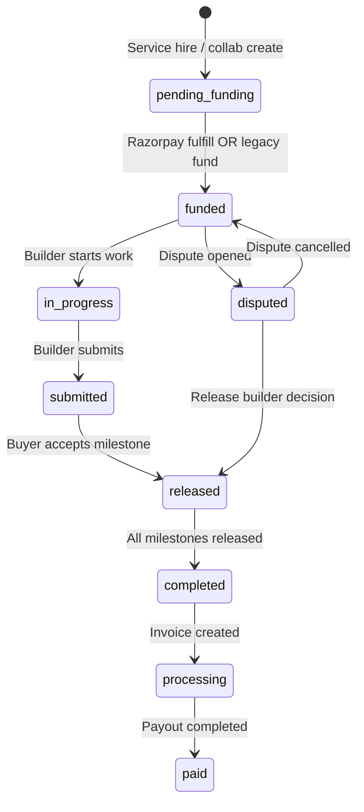

# Finance Status Audit — Phase 1

Audit date: 2026-07-19  
Scope: `pending_funding`, `funded`, `released`, `completed`, `processing`, `refunded`, `failed`, `cancelled`  
Categories: **DB** (migrations/schema), **API** (route handlers), **Frontend** (pages/components), **Utility** (lib helpers), **Validation** (checks/constraints), **Trigger** (DB triggers/RPC side effects)

---

## Summary

| Status | Primary domain | Finance-critical? |
|--------|----------------|-------------------|
| `pending_funding` | Collab checkout lifecycle | Yes — pre-payment escrow state |
| `funded` | Collab, milestone, escrow_transactions, project_requests | Yes — locked escrow |
| `released` | Milestone payout, collab completion | Yes — builder payout trigger |
| `completed` | Transactions, milestones, collabs, withdrawals, refunds | Yes — terminal success states |
| `processing` | Invoices, withdrawals, refund_requests | Yes — in-flight financial ops |
| `refunded` | transactions | Yes — payment reversal |
| `failed` | withdrawals, refund_requests, disputes | Yes — failed financial ops |
| `cancelled` | collabs, withdrawals, disputes, open projects | Yes — cancellation / reversal paths |

---

## `pending_funding`

| File | Line | Context | Category |
|------|------|---------|----------|
| `supabase/migrations/20260702170000_restore_pending_funding_status.sql` | 2–14 | Restores `pending_funding` in collab status CHECK constraint | DB |
| `supabase/migrations/20260701184100_buyer_critical_workflows.sql` | 195 | Collab status enum includes `pending_funding` | DB |
| `lib/hire/createCollab.ts` | 31 | New service collab created with `status: "pending_funding"` | Utility |
| `lib/quotations/index.ts` | 79, 132 | Query active collabs; new quotation collab set to `pending_funding` | Utility |
| `lib/milestones/syncServiceCheckoutPrice.ts` | 32, 76 | Guards price sync when collab is `pending_funding` | Utility |
| `lib/marketplace/status.ts` | 11 | `PENDING_COLLAB_STATUSES` includes `pending_funding` | Utility |
| `lib/payments/fulfillRazorpayPayment.ts` | 99 | Milestone funding allowed from `draft` or `pending_funding` | Utility |
| `app/api/checkout/cleanup/route.ts` | 31, 39 | Expires stale collabs/transactions in `pending_funding` | API |
| `app/api/razorpay/order/route.ts` | 161–164 | Blocks archived service only when collab still `pending_funding` | API |
| `app/buyer/collabs/new/page.tsx` | 140 | Collab insert with `status: 'pending_funding'` | Frontend |
| `app/buyer/dashboard/page.tsx` | 78 | `PENDING_COLLAB_STATUSES` filter set | Frontend |
| `app/service/[id]/page.tsx` | 165, 171 | Detect existing collab; redirect if `pending_funding` | Frontend |

---

## `funded`

| File | Line | Context | Category |
|------|------|---------|----------|
| `lib/milestones/platformFees.ts` | 17–24, 48, 98, 109 | `FUNDED_MILESTONE_STATUSES` array drives fee logic | Utility |
| `lib/marketplace/status.ts` | 4, 15 | Active/locked collab and milestone status sets | Utility |
| `lib/founder/overview.ts` | 15 | `ACTIVE_ESCROW_COLLAB_STATUSES` includes `funded` | Utility |
| `lib/payments/fulfillRazorpayPayment.ts` | 97, 127, 152, 177, 192, 204, 215 | Milestone/collab funded; escrow_transactions insert | Utility |
| `lib/project-proposals/service.ts` | 181, 248 | Project request funded check and status update | Utility |
| `lib/builder/earningsLedger.ts` | 77, 83, 190, 202, 288 | Escrow deposit / pending balance logic | Utility |
| `lib/disputes/completePaymentExecution.ts` | 73 | Dispute resolution may restore collab to `funded` | Utility |
| `lib/disputes/participantSummary.ts` | 26 | Completed collab query (with `released`) | Utility |
| `lib/open-projects/verifiedBuyer.ts` | 27 | Verified buyer completed contracts query | Utility |
| `supabase/migrations/20260702140000_proposal_platform_fee_charged.sql` | 16 | Backfill funded milestone statuses | DB |
| `supabase/migrations/20260701184100_buyer_critical_workflows.sql` | 226 | Milestone status CHECK constraint | DB |
| `supabase/migrations/20260702120000_proposal_cards_in_chat.sql` | 8 | project_requests status CHECK includes `funded` | DB |
| `app/api/project-requests/[id]/fund/route.ts` | 61, 73, 88 | **Legacy** direct fund — sets collab/milestone/request to `funded` | API |
| `app/api/project-requests/[id]/fund-milestones/route.ts` | 68, 81, 97 | **Legacy** milestone fund route | API |
| `app/api/milestones/[id]/route.ts` | — | Milestone workflow transitions from `funded` | API |
| `app/api/razorpay/order/route.ts` | 156 | Rejects order if milestone already `funded` | API |
| `app/api/collabs/[id]/add-milestone/route.ts` | 57 | Requires collab `funded` or `in_progress` | API |
| `app/api/disputes/route.ts` | 644 | Restores collab to pre-dispute status (often `funded`) | API |
| `app/api/buyer/dashboard/route.ts` | 150 | Dashboard status label mapping | API |
| `components/MilestoneManager.tsx` | 189–195, 305, 318, 548 | UI totals, badges, fund/start-work actions | Frontend |
| `components/chat/MilestoneChatCard.tsx` | — | Milestone status display | Frontend |
| `types/marketplace.ts` | 13, 158 | Type unions for collab/milestone status | Utility |
| `app/collab/[id]/page.tsx` | — | Collab workspace status handling | Frontend |
| `app/buyer/projects/page.tsx` | 41, 113 | Project filter and badge styling | Frontend |

---

## `released`

| File | Line | Context | Category |
|------|------|---------|----------|
| `lib/milestones/platformFees.ts` | 22 | In `FUNDED_MILESTONE_STATUSES` | Utility |
| `lib/marketplace/status.ts` | 12, 16 | `COMPLETED_COLLAB_STATUSES`, `COMPLETED_MILESTONE_STATUSES` | Utility |
| `lib/builder/earningsLedger.ts` | 232 | Uninvoiced completed collabs with status `released` | Utility |
| `lib/disputes/completePaymentExecution.ts` | 73 | Dispute close sets collab to `released` (non-cancelled) | Utility |
| `lib/disputes/participantSummary.ts` | 26 | Completed project count | Utility |
| `lib/open-projects/verifiedBuyer.ts` | 27 | Verified buyer contracts | Utility |
| `supabase/migrations/20260704152000_withdrawal_workflow_hardening.sql` | 51 | Collab earnings when status `completed` or `released` | DB |
| `app/api/milestones/[id]/route.ts` | 286, 328 | **Milestone accept** → `released` + invoice creation | API |
| `app/api/collabs/[id]/complete/route.ts` | 43 | Requires all milestones `released` before project complete | API |
| `app/api/reviews/route.ts` | 48, 96, 122 | Review eligibility on `released`/`completed` collabs | API |
| `components/MilestoneManager.tsx` | 67, 204–205, 308, 424, 591 | Escrow totals, badge, released UI state | Frontend |
| `app/collab/[id]/page.tsx` | 199 | `isCompleted` includes `released` | Frontend |
| `types/marketplace.ts` | 161 | Milestone status union | Utility |

---

## `completed`

| File | Line | Context | Category |
|------|------|---------|----------|
| `lib/payments/fulfillRazorpayPayment.ts` | 49 | Transaction marked `completed` on payment capture | Utility |
| `lib/refunds/service.ts` | 75, 251, 266–273 | Refund only on `completed` transactions; refund terminal status | Utility |
| `lib/builder/earningsLedger.ts` | 17, 130, 232, 311 | Withdrawal reserved statuses; component txns; collab earnings | Utility |
| `lib/marketplace/status.ts` | 12, 16 | Completed collab/milestone sets | Utility |
| `lib/billing/fetchBillingHistory.ts` | 23, 75 | Billing history filters `completed` transactions | Utility |
| `lib/disputes/completePaymentExecution.ts` | 33 | `payment_execution_status: 'completed'` | Utility |
| `lib/project-proposals/service.ts` | 181, 184 | Proposal locked when project `completed` | Utility |
| `supabase/migrations/20260718100000_founder_dispute_center_rearchitecture.sql` | 39, 72 | Dispute status mapping; payment_execution_status CHECK | DB |
| `supabase/migrations/20260704152000_withdrawal_workflow_hardening.sql` | 24, 60 | Withdrawal status CHECK; component transaction filter | DB |
| `supabase/migrations/20260702140000_proposal_platform_fee_charged.sql` | 18 | Transaction backfill filter `status = 'completed'` | DB |
| `app/api/founder/withdrawals/[id]/route.ts` | 24, 42, 160 | Withdrawal lifecycle terminal state | API |
| `app/api/workspace/billing/route.ts` | 81, 132 | Release allowed when collab `completed`; sets collab `completed` | API |
| `app/api/collabs/[id]/complete/route.ts` | 52, 72 | Project completion sets collab `completed` | API |
| `app/api/milestones/[id]/route.ts` | — | Milestone terminal state in fee/status sets | API |
| `components/builder/EarningsLedgerPanel.tsx` | 25, 51 | Ledger status badge for `processing`/`completed` | Frontend |
| `app/builder/wallet/page.tsx` | 32 | Invoice query includes `paid`, `processing` | Frontend |
| `types/marketplace.ts` | 12, 145, 219 | Marketplace type definitions | Utility |

---

## `processing`

| File | Line | Context | Category |
|------|------|---------|----------|
| `lib/refunds/service.ts` | 234 | Refund request enters `processing` before Razorpay call | Utility |
| `lib/builder/earningsLedger.ts` | 16, 63, 223, 315 | Withdrawal reserved statuses; invoice cleared check | Utility |
| `supabase/migrations/20260704152000_withdrawal_workflow_hardening.sql` | 23, 45 | Withdrawal status CHECK; invoice earnings sum | DB |
| `supabase/migrations/20260718100000_founder_dispute_center_rearchitecture.sql` | 72 | `payment_execution_status IN ('pending', 'in_progress', 'completed', 'failed', ...)` | DB |
| `app/api/founder/withdrawals/[id]/route.ts` | 22, 38, 42 | Withdrawal state machine transitions | API |
| `app/api/milestones/[id]/route.ts` | 307 | Invoice created with `status: 'processing'` | API |
| `app/api/workspace/billing/route.ts` | 107 | Invoice created with `status: 'processing'` | API |
| `app/founder/payments/page.tsx` | — | Founder payments UI status filters | Frontend |
| `components/builder/EarningsLedgerPanel.tsx` | 25, 51 | Withdrawal/invoice processing badge | Frontend |
| `app/builder/wallet/page.tsx` | 32 | Cleared balance from `paid`/`processing` invoices | Frontend |

---

## `refunded`

| File | Line | Context | Category |
|------|------|---------|----------|
| `lib/refunds/service.ts` | 269 | Transaction updated to `refunded` after successful Razorpay refund | Utility |
| `app/api/collabs/[id]/refundable-transactions/route.ts` | — | Lists refundable completed transactions | API |
| `components/RefundPanel.tsx` | — | Buyer refund UI | Frontend |
| `app/refund-escrow-policy/page.tsx` | — | Policy copy referencing refunds | Frontend |

---

## `failed`

| File | Line | Context | Category |
|------|------|---------|----------|
| `lib/refunds/service.ts` | 89, 212–213, 251, 259, 278, 307 | Refund request terminal/failure paths | Utility |
| `lib/builder/earningsLedger.ts` | 25, 79, 83, 317 | Ledger entry failure states | Utility |
| `lib/payments/razorpayOrderLog.ts` | 4, 12, 42 | Order/checkout failure event types | Utility |
| `supabase/migrations/20260718100000_founder_dispute_center_rearchitecture.sql` | 72 | Dispute payment_execution_status | DB |
| `supabase/migrations/20260704152000_withdrawal_workflow_hardening.sql` | 25 | Withdrawal status CHECK | DB |
| `app/api/founder/withdrawals/[id]/route.ts` | 26, 42, 46, 152–154 | Withdrawal failure handling | API |
| `components/RazorpayCheckoutButton.tsx` | 526, 612, 675, 759, 773 | Payment verification/fulfillment failures | Frontend |
| `lib/disputes/completePaymentExecution.ts` | 33, 63–66 | Payment execution failure on dispute close | Utility |

---

## `cancelled`

| File | Line | Context | Category |
|------|------|---------|----------|
| `lib/marketplace/status.ts` | 13 | `CANCELLED_COLLAB_STATUSES` | Utility |
| `lib/builder/earningsLedger.ts` | 169, 183, 288 | Cancelled collab escrow refund ledger entries | Utility |
| `lib/open-projects/service.ts` | 830 | Open project soft-delete sets `cancelled` | Utility |
| `lib/refunds/service.ts` | 89 | Excludes terminal refund statuses including `cancelled` | Utility |
| `supabase/migrations/20260717180000_open_projects_marketplace_enhancements.sql` | 10, 36 | Open project / proposal status CHECK | DB |
| `supabase/migrations/20260718100000_founder_dispute_center_rearchitecture.sql` | 35, 67 | Dispute decision_type `cancelled` | DB |
| `app/api/founder/withdrawals/[id]/route.ts` | 28, 34, 36, 38, 48 | Withdrawal cancellation transitions | API |
| `lib/disputes/completePaymentExecution.ts` | 73 | Cancelled dispute restores collab to `funded` | Utility |
| `lib/arena/badges/evaluators.ts` | 24, 26 | Arena badge cancelled collab signals | Utility |
| `components/MilestoneManager.tsx` | — | Dispute/cancel UI guards | Frontend |

---

## Non-finance occurrences (informational)

Many files use these strings in **error messages**, **auth flows**, or **copy** without financial semantics (e.g. `Authentication failed`, `Action failed`, TrackerEngine "processing loop"). These were excluded from the tables above unless they affect financial state machines.

Notable non-finance patterns:
- `components/TrackerEngine.tsx` — telemetry "processing" (not payment)
- `app/auth/callback/page.tsx` — auth `failed` status display
- `lib/moderation/*` — moderation job `failed` alerts

---

## Finance state machine (high level)

